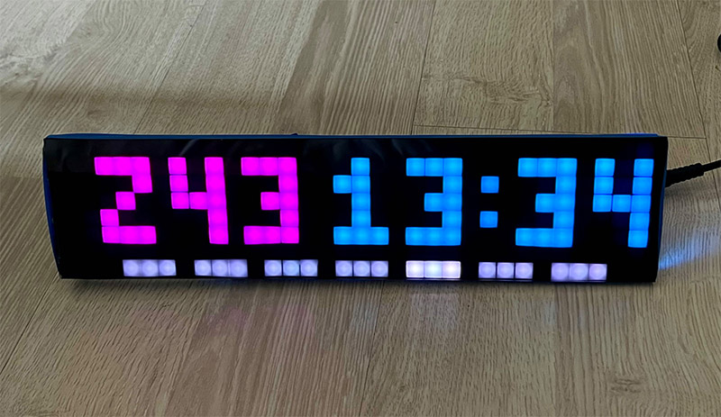
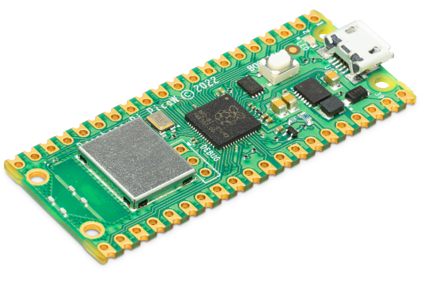
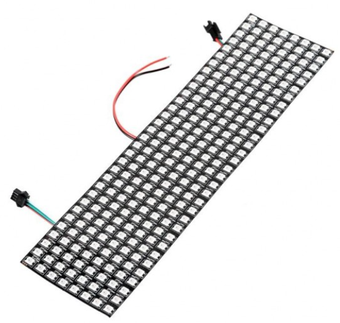

# Neo32x8 Pico W
A DIY awtrix-like matrix LED display with Raspberry picow and 2812b LEDs

## Introduction

This is a DIY LED matrix display based on Raspberry Pi Pico W, using 2812b LED beads, 32x8 matrix, can display time, github repo stars, support multiple display modes.

## Hardware:

- Raspberry Pi Pico W
- 2812b LED strip (32x8)
- generic 5V power supply
- grid board and a DIY caseb (or 3D printed)
- buttons and a rotary encoder

## Software:
- [CircuitPython](https://circuitpython.org/board/raspberry_pi_pico_w/) v8.2.6
- A self-hosted server(optional)
  - flask or fastapi
- code in this repo

## GPIO Pinout

### LED matrix 2812b
- GP28

### Rotatory encoder
- A: GP16
- B: GP17
- Button: GP18

### Buttons
- GP19, 
- GP20
- GP21

### Status LED
- GP22

## How to use
1. Install CircuitPython on Raspberry Pi Pico W
2. Wire up the hardware
3. Copy all files in `picow` folder to the root of the Pico W
4. Modify the settings.toml file to your own settings(wifi, server address, etc)
5. Modify the code to your own needs

## Reference
- Pico W: https://www.raspberrypi.com/products/raspberry-pi-pico/
- Circuit Python: https://circuitpython.org/board/raspberry_pi_pico_w/
- Some useful libraries: https://github.com/adafruit/Adafruit_CircuitPython_Bundle
- IDE: https://thonny.org/
